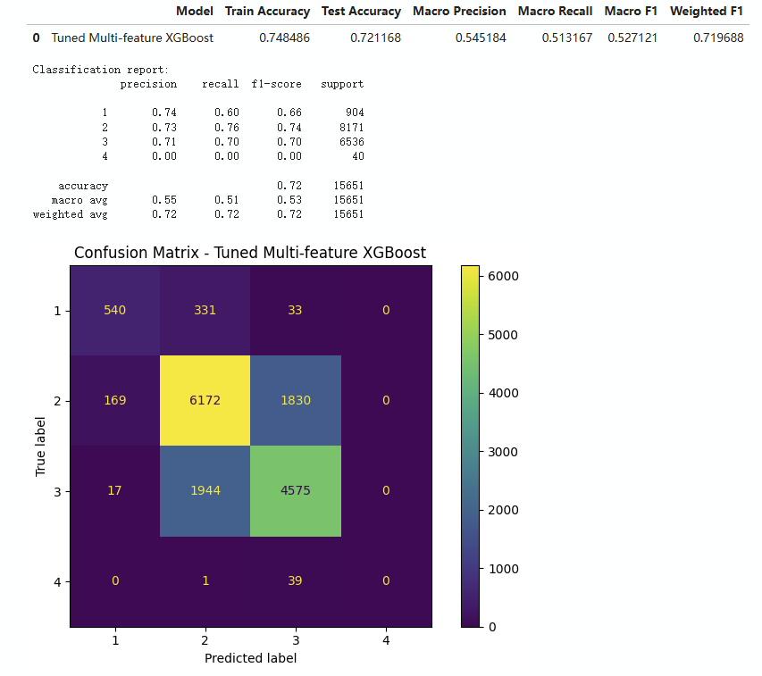
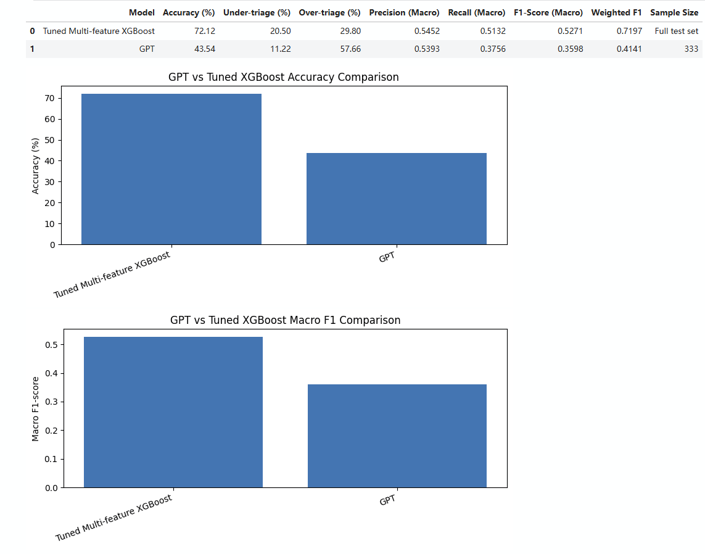

# Emergency Triage Prediction with Machine Learning

This repository presents selected work from my university capstone project on predicting emergency department triage acuity using machine learning.

The project focused on predicting triage levels using information available early in a patient's emergency department visit, including chief complaints, vital signs, gender and arrival transport.

My main focus was reproducing and improving the machine learning pipeline, evaluating different models, and analysing model performance using both standard classification metrics and safety-related measures.

---

## Project Overview

Emergency department triage is a multi-class classification problem where patients are assigned an acuity level based on the urgency of their condition.

The final task predicted four acuity levels:

- Acuity 1
- Acuity 2
- Acuity 3
- Acuity 4

The dataset included features such as:

- Chief complaint
- Detailed chief complaint
- Temperature
- Heart rate
- Respiratory rate
- Oxygen saturation
- Systolic blood pressure
- Diastolic blood pressure
- Gender
- Arrival transport

Acuity 5 was excluded because there were too few samples for meaningful modelling.

---

## My Contribution

My main contributions included:

- Cleaning and preprocessing clinical data using Python and Pandas
- Preparing text, categorical and numerical features
- Developing a complaint-only Logistic Regression baseline
- Reproducing and evaluating multiple machine learning models
- Training and tuning an XGBoost classifier
- Comparing Logistic Regression, Decision Tree, Random Forest and XGBoost
- Evaluating accuracy, macro F1 and weighted F1
- Calculating under-triage and over-triage rates
- Analysing confusion matrices and model errors
- Conducting an additional LLM-based comparison experiment
- Collaborating with team members using Git and GitHub

---

## Technologies

- Python
- Pandas
- NumPy
- Scikit-learn
- XGBoost
- Jupyter Notebook
- Matplotlib
- Git
- GitHub

---

## Model Development

Several classification models were evaluated, including:

- Logistic Regression
- Decision Tree
- Random Forest
- XGBoost

A complaint-only Logistic Regression model was first used as a baseline.

The baseline achieved:

**68.54% accuracy**

Additional patient information and vital signs were then included, and XGBoost was further tuned to improve performance.

---

## Final Model – Tuned XGBoost

The tuned XGBoost model achieved the best overall performance in my experiments.

| Metric | Result |
|---|---:|
| Accuracy | **72.12%** |
| Macro F1 | **0.5271** |
| Weighted F1 | **0.7197** |
| Under-triage | **20.5%** |
| Over-triage | **29.8%** |

The tuned model improved accuracy by approximately **3.58 percentage points** compared with the complaint-only baseline.

### Tuned XGBoost Confusion Matrix



---

## Model Evaluation

Accuracy alone was not sufficient for evaluating this task.

Because triage prediction can have safety implications, I also evaluated:

### Under-triage

Under-triage occurs when a patient is predicted as less urgent than their true triage level.

This is an important safety measure because severe under-triage may delay treatment for high-risk patients.

### Over-triage

Over-triage occurs when a patient is predicted as more urgent than their true triage level.

Although generally less dangerous than under-triage, excessive over-triage can increase pressure on emergency department resources.

The tuned XGBoost model achieved:

- **20.5% under-triage**
- **29.8% over-triage**

---

## Challenges

One of the main challenges was class imbalance.

Most records belonged to acuity levels 2 and 3, while acuity level 4 had significantly fewer examples.

Another challenge was that neighbouring triage levels can be difficult to distinguish using only information available early in the patient journey.

These limitations affected both overall classification performance and minority-class prediction.

---

## LLM Comparison

As an additional experiment, I also evaluated a large language model using a zero-shot prompting approach.

The purpose of this experiment was to compare the behaviour of an LLM with the traditional machine learning pipeline rather than to replace the final machine learning model.

The LLM tended to make more conservative predictions and produced substantially more over-triage.

The tuned XGBoost model remained the stronger approach for this task.

### ML and LLM Comparison



---

## Repository Structure

```text
healthcare-ai-ml-project/
│
├── images/
│   ├── tuned_xgboost_confusion_matrix.png
│   ├── gpt_acuity_confusion_matrix.png
│   └── gpt_vs_tuned_xgboost.png
│
├── notebooks/
│   ├── task1_acuity_model_reproduction...
│   ├── task1_acuity_model_reproduction...
│   └── task1_gpt_acuity_experiment.ipynb
│
├── .gitignore
└── README.md
```

---

## What I Learned

This project gave me practical experience in building an end-to-end machine learning workflow, working with imbalanced real-world data, comparing multiple classification models, tuning XGBoost, and evaluating models using both traditional and domain-specific metrics.

It also gave me experience analysing model limitations rather than relying only on overall accuracy.

---

## Project Note

This repository is a portfolio version of a university team project.

It contains selected work related to my own contribution. Original restricted datasets and confidential project material are not included.
